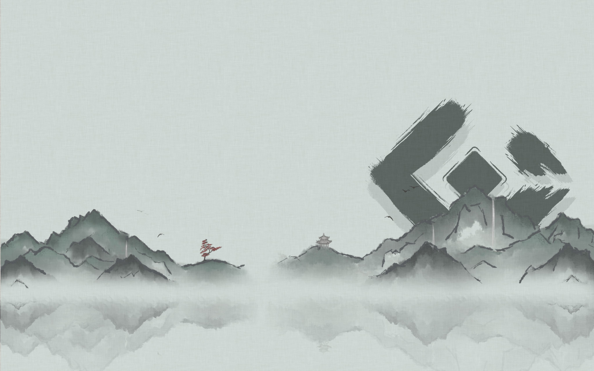

# shuimo-wallpaper

you can choose single wallpaper as your wallpaper,

or you can use [shuimo.heic](./build/shuimo.heic) as your wallpaper in mac.

**This project follows the [CC BY-NC-ND 4.0](./LICENSE) license** 

> Of course, if you have any build upon needs or other needs, please contact us, we are honored and happy to help you.

## wallpapers

#### light(green)



#### dark(night)


#### morning


#### noon


#### dusk


#### rain


also you can build your own `heic wallpaper` with this project.

## build

you can modify the `shuimo.json` file to build your own wallpaper.

```shell
./bin/wallpapper -i shuimo.json -o build/shuimo.heic
```

### TODO

- [ ] Use script to generate black rectangular blocks to support Mac notch screen for better interaction 
- [ ] Phone wallpaper
- [ ] Wallpaper engine
- [ ] Support change wallpaper size


### THANKS

`heic` build bin by [mczachurski/wallpaper](https://github.com/mczachurski/wallpapper)
